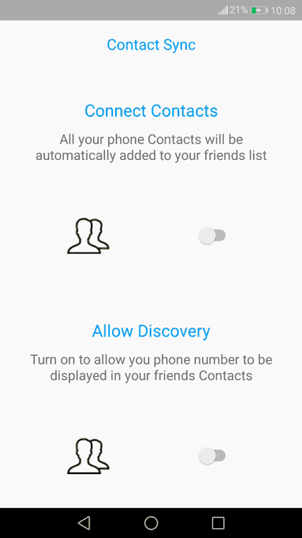
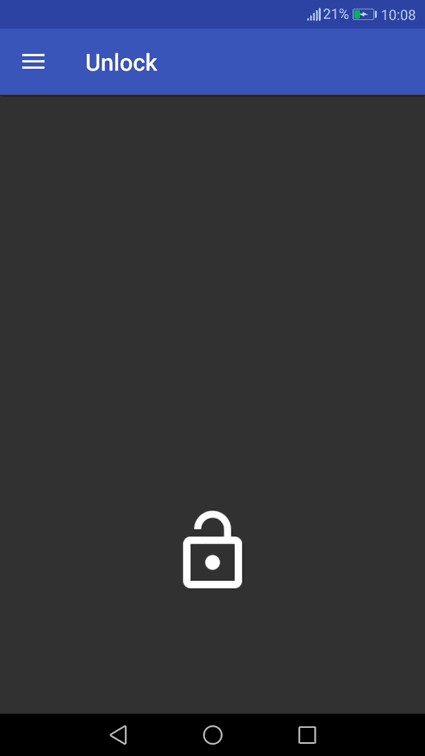
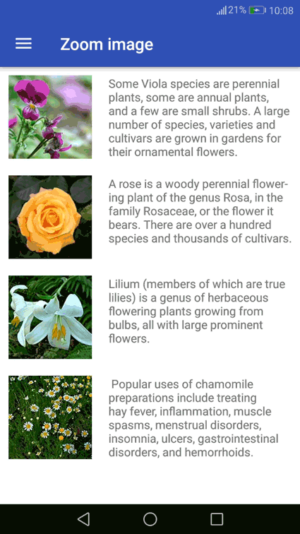
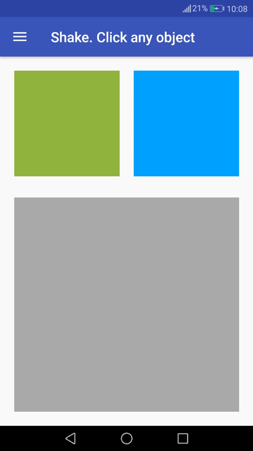
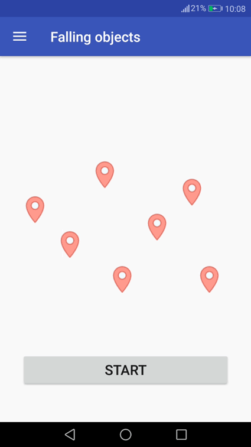
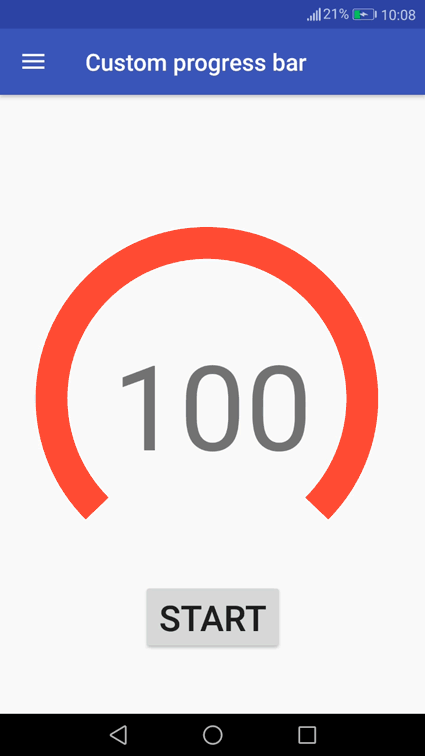
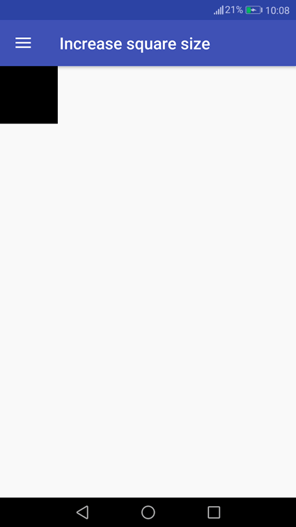
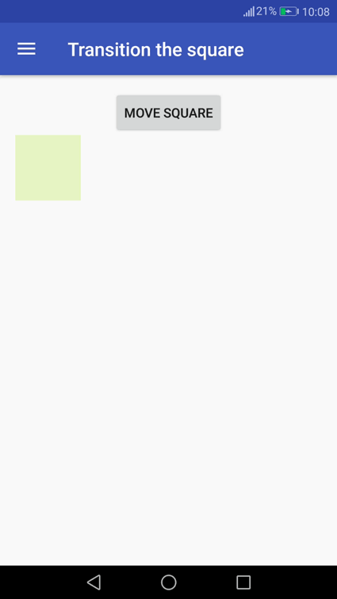
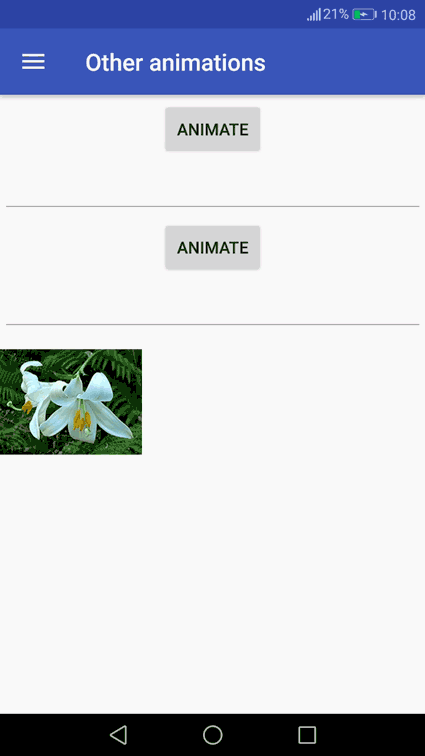

# Animations
In this project you can find the number of animations which you can realize for Android applications.

## Content:
[Contact Sync by Ramotion](#contact_synd)
 [Unlock](#unlock)
 [Zoom image](#zoom_image)
 [Shake an object](#shake)
 [Falling objects](#falling)
 [Custom progress bar](#progress_bar)
 [Increase square size](#increase)
 [Transition square](#transition)
 [Other animations](#other)

<a name="contact_synd"><h2>Contact Sync by Ramotion</h2></a>
Design for this animation is taken from [Dribbble](https://dribbble.com/shots/1749645-Contact-Sync). It created by [Ramotion](https://www.ramotion.com/?utm_source=drbl&utm_medium=special&utm_campaign=profile-link) team. Nice looking way to fill the background. 
   

<a name="unlock"><h2>Unlock</h2></a>
There is presented the circular animation, which change visibility property of embedded content it triggered. For example, it can be used for the appearance of the map after clicking the icon.
   

<a name="zoom_image"><h2>Zoom image</h2></a>
This method helps you to transition, when the user choose the element in the list for more detailed information about it.
   

<a name="shake"><h2>Shake an object</h2></a>
During the clicking the objects starts to “shake”. This effect can be used for user’s attention concentration.
   

<a name="falling"><h2>Falling objects</h2></a>
It can be used for adding tags on the map.
   

<a name="progress_bar"><h2>Custom progress bar</h2></a>
 

<a name="increase"><h2>Increase square size</h2></a>
 

<a name="transition"><h2>Transition square</h2></a>
 

<a name="other"><h2>Other animations</h2></a>
 
